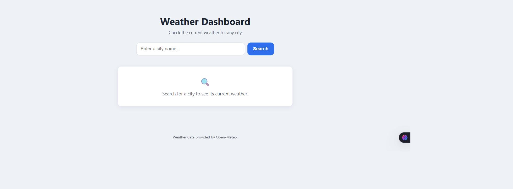
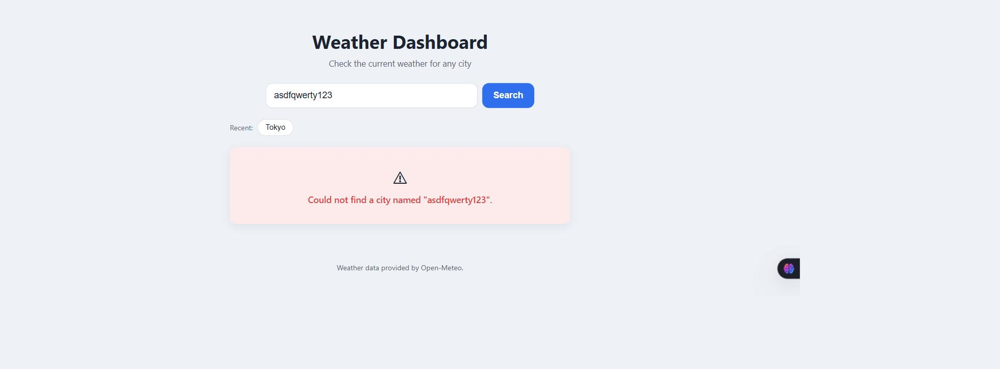

# Weather Dashboard

A small vanilla JavaScript weather app: search a city, see its current
weather. Built as a learning project — frontend only, no frameworks, no
build step, no backend.
LINK: https://weatherdashboard001v1.netlify.app/

Weather data comes from [Open-Meteo](https://open-meteo.com/) (no API key
required).

## Features

- Search current weather for any city
- Weather condition icon plus readable condition text (e.g. "Partly
  cloudy" with a matching emoji)
- Temperature, humidity, wind speed, and "feels like" temperature,
  clearly formatted with units
- Recent searches — the last 5 cities searched, saved locally and
  shown as clickable chips to search again
- Last-searched city automatically restores when you reload the page
- Friendly error handling — a city that can't be found and a dropped
  connection show distinct, human-readable messages, never a raw
  browser error
- Responsive, mobile-first layout
- Clear loading feedback — the search button, input, and recent-search
  chips all disable while a search is in progress

## Technologies

- Vanilla HTML, CSS, and JavaScript (ES modules) — no frameworks, no
  build tools, no npm dependencies
- [Open-Meteo](https://open-meteo.com/) for geocoding and weather data
  — free and keyless
- Browser `localStorage` for recent-searches persistence

## Running it locally

This app uses ES modules (`import`/`export`), which browsers only allow
over `http://`, not `file://`. So it needs to be served, not just opened
directly. Any static file server works, for example:

```bash
cd weather-dashboard
python -m http.server 8000
```

Then open `http://localhost:8000/index.html`.

There's no `npm install`, no environment variables, and no config —
just static files.

## Deployment

This is a static site with no backend and no build step, so
"deploying" just means uploading the files to any static host —
GitHub Pages, Netlify, Vercel (static), S3 + CloudFront, or similar
all work with no configuration.

The one requirement, same as running it locally: the site must be
served over `http://` or `https://`, since ES modules don't work from
a `file://` URL. HTTPS is recommended (most of the hosts above default
to it) as general good practice, not because Open-Meteo requires it.

There are no environment variables or secrets to configure — there's
no API key to set up.

## Project structure

The main thing this project is meant to demonstrate is **keeping
concerns separated**: each file has exactly one job, and doesn't reach
into another file's responsibility. That separation is enforced
end-to-end, not just at the top level:

```
weather-dashboard/
├── index.html              Markup/structure
├── css/
│   └── style.css            All styling, mobile-first responsive
└── js/
    ├── api.js               Talks to the weather API. Nothing else.
    ├── weatherFormatter.js  Turns raw API data into display-ready text. Nothing else.
    ├── storage.js            Reads/writes recent searches in localStorage. Nothing else.
    └── app.js                Wires it all together and updates the page.
```

**`js/api.js`** — API communication only. No DOM access, no
`localStorage`. Geocodes a city name via Open-Meteo, then fetches
current conditions for those coordinates. Every technical failure —
a dropped connection, a bad HTTP response, unexpected response data —
is caught here and turned into one friendly message
(`"Unable to connect. Please check your internet connection and try
again."`) before it ever leaves this file, so nothing else in the app
has to deal with raw browser/network error text. A city that's
genuinely not found is treated differently: its specific "Could not
find a city named ..." message is allowed through unchanged, since
that's a valid search outcome, not a technical failure.

**`js/weatherFormatter.js`** — data formatting only. No DOM, no
network calls. Takes the plain data object `api.js` returns and turns
it into display-ready strings: rounds temperatures, adds units
(`°C`, `%`, `km/h`), and maps Open-Meteo's numeric weather codes to
readable text and an emoji icon. Pure input-in, string-out functions —
nothing here needs a browser at all.

**`js/storage.js`** — `localStorage` persistence only. No DOM, no
network. Keeps a "recent searches" list under the namespaced key
`weatherDashboard.recentSearches`: most-recent-first, capped at 5
entries, case-insensitive de-duplication (searching a city already in
the list moves it to the top instead of adding a duplicate). Also
exposes the single most recent city, used to restore the last search
on page load. Storage reads/writes are defensive — a corrupted or
tampered value falls back to an empty list instead of crashing the
app.

**`js/app.js`** — application flow, and the only file that touches
the DOM. Wires up the search form, switches between the
idle/loading/error/result states, and orchestrates the other three
modules: calls `api.js` for data, `weatherFormatter.js` to make it
readable, and `storage.js` to remember successful searches (never
failed ones) and to re-run the last search on page load. It contains
no formatting math and no direct `localStorage` calls — those always
go through the modules above. It also tracks whether a search is in
progress so the search button, input, and recent-search chips all
disable together, preventing two overlapping searches from racing
each other and showing the wrong result.

**`css/style.css`** — mobile-first, with breakpoints at 600px and
900px. No CSS framework.

## Security & limitations

This app is intentionally frontend-only, which shapes what "security"
means for it:

- There's no API key to protect, because Open-Meteo doesn't require
  one — so there's nothing to hide in the client code, and no backend
  needed just to keep a key secret.
- There's no server-side rate-limiting layer, because there's no
  server. That's a structural property of a static, backend-less app,
  not a gap in this project.
- Recent searches are stored only in the visiting browser's own
  `localStorage`. That data is never sent anywhere — not to Open-Meteo,
  not to any server this project controls (there isn't one) — so it
  never leaves the user's device.
- All data shown on the page is inserted via `textContent`, never
  `innerHTML`, so there's no injection path from a city name or API
  response into the page's HTML.

## Screenshots

**Idle state**



**Search result**


**Error state**



## How it was built

The app was built in five milestones, each adding one layer without
disturbing the ones before it:

1. **Static shell** — project structure, HTML layout, responsive CSS,
   and placeholder idle/loading/error/result states. No JavaScript
   logic yet.
2. **API integration** — wired the search form up to Open-Meteo
   through `api.js`, with a follow-up pass to make sure network/API
   failures show a friendly message instead of a raw browser error.
3. **Weather experience upgrade** — introduced `weatherFormatter.js`
   as its own layer, added condition icons, and polished the result
   card's visual hierarchy.
4. **UX improvements** — better loading feedback (button disables
   during a search, loading message names the city), recent searches
   via `storage.js`, and restoring the last-searched city on reload.
5. **Production polish** — a security and performance review; fixed a
   real race condition where clicking two recent-search chips in quick
   succession could show the wrong city; made `storage.js` resilient
   to corrupted/tampered data; added smooth state transitions
   (respecting `prefers-reduced-motion`) and small UI polish.
